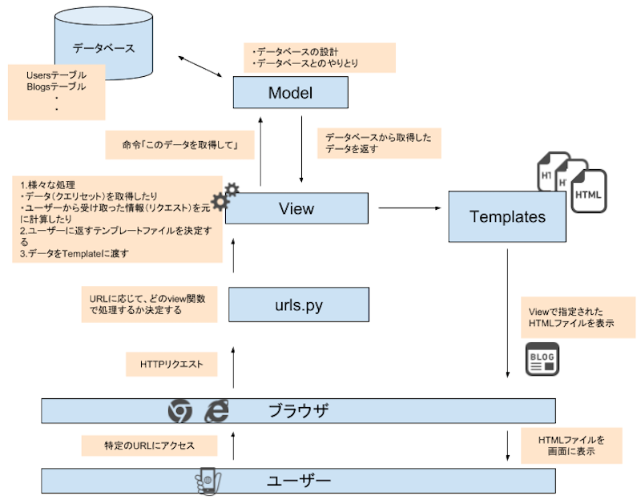

# 概要

## Djangoについて
Djangoは、バックエンド開発に使用されるPython製のWebアプリケーションフレームワークです。Webアプリケーションをゼロから作る場合、通信処理、セキュリティ対策、データベースの管理など多くの複雑な技術が必要となりますが、Djangoを利用することでこれらを簡単に実装できます。 

多くの大規模サービス、例えばYouTube、Instagram、Spotify、Pinterest、DropboxなどがDjangoを活用しており、その強力な機能と効率性から選ばれています。

## 全体像
Djangoは、主にurls, views, models, templatesのファイルで構成されています。(MVT.png参照) 
- urls: ブラウザから受け取ったURLに応じて、適切なページに誘導する。 
- views: メインの処理を行う部分。 
- models: データベースと連携する部分。 
- templates: HTMLなどのテンプレートを呼び出す部分。 

流れ: 
urlsがリクエストをブラウザから受け取る 
→URLに応じたviewを呼び出す 
→viewがmodelsからデータを受け取る 
→viewがデータをtemplatesに当てはめ、ブラウザにWebページを返す 

すぐに全部は覚えなくても大丈夫ですが、Djangoを理解するうえで重要なポイントなので、**開発中に何をしているかわからなくなったらこのページを見返してみましょう。**